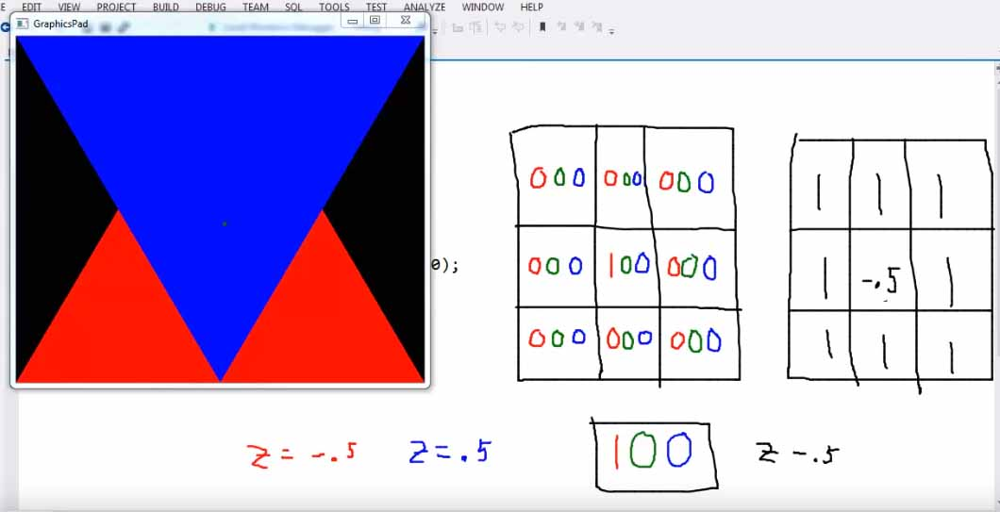

# Computer_Graphics_Using_OpenGL

## 20. OpenGL Depth Buffer

indices[]의 앞쪽에 있는 정점을 먼저 render하기 때문에 나중에 그린것이 위에 위치하게 된다. 
수천수만개의 폴리곤의 depth를 배열순서를 이용해 지정할 수 없고, 또한 뭔가가 앞에 있는 경우 뒤에 있는것은 그리지 않아도 된다.

z축은 가까운쪽이 -, 먼쪽이 +이다. 

렌더링의 최종결과물은 2d상의 pixel이다. 각 pixel은 RGB값을 가지며 R을 얼만큼, G를 얼만큼, B를 얼만큼 showing할지에 정보이다.
Fragment shader로부터 나온 RGB값 3개를 2d array로 저장하며 이를 color buffer라 한다. 

또 다른 2d array가 있는데 이것은 z값을 저장하며 이를 depth buffer라 한다. depth test를 통과한 frament가 pixel이 된다. 
그후에 color buffer에 그 pixel의 컬러값이 저장된다. 그 pixel의 z값으로 depth buffer가 채워진다.
depth test 통과에 실패한 fragment는 pixel이 되지 못하고 reject된다. 
