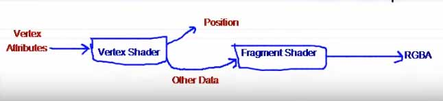

# Computer_Graphics_Using_OpenGL

## 20. OpenGL Depth Buffer

indices[]의 앞쪽에 있는 정점을 먼저 render하기 때문에 나중에 그린것이 위에 위치하게 된다. 
수천수만개의 폴리곤의 depth를 배열순서를 이용해 지정할 수 없고, 또한 뭔가가 앞에 있는 경우 뒤에 있는것은 그리지 않아도 된다.

z축은 가까운쪽이 -, 먼쪽이 +이다. 

렌더링의 최종결과물은 2d상의 pixel이다. 각 pixel은 RGB값을 가지며 R을 얼만큼, G를 얼만큼, B를 얼만큼 showing할지에 정보이다.
Fragment shader로부터 나온 RGB값 3개를 2d array로 저장하며 이를 color buffer라 한다. 

또 다른 2d array가 있는데 이것은 z값을 저장하며 이를 depth buffer라 한다. depth test를 통과한 frament가 pixel이 된다. 
그후에 color buffer에 그 pixel의 컬러값이 저장된다. 그 pixel의 z값으로 depth buffer가 채워진다.
depth test 통과에 실패한 fragment는 pixel이 되지 못하고 reject된다. 

## 21. OpenGL glEnable Depth Test

z test는 비용이 들기 때문에 default로 꺼져있다. 따라서 사용하려면 enable해줘야 한다. 
glEnable(GL_DEPTH_TEST);

매프레임 paint 해줄때마다 1로 refresh 해줘야 한다.
glClear(GL_DEPTH_BUFFER_BIT);

## 22. OpenGL Depth Interpolation

depth test할때 z값은 1이므로 정점의 z값이 1이면 통과하지 못하고 실패해서 그려지지 않는다.

만약 -1보다 작은값이여도 역시 통과하지 못한다. camera보다 뒤에 있으므로 그리지 않는다.

z값 보간, color값도 보간

## 23. OpenGL Sending Triangles in Parts Using glBufferSubData

buffer object에 실제 데이터가 저장되는것이 아니고 
데이터는 bytes array 형태로 buffer에 저장되고 buffer object는 buffer의 property를 가지고 있는다.

glBufferData(GL_ARRAY_BUFFER, MAX_TRIS * TRIANGLE_BYTE_SIZE, NULL, GL_STATIC_DRAW);
로 일정량의 버퍼공간을 생성하고,
glBufferSubData(GL_ARRAY_BUFFER, numTris * TRIANGLE_BYTE_SIZE, TRIANGLE_BYTE_SIZE, thisTri);
로 전체버퍼공간이 아닌(전체공간일수도 있음) 일부에 데이터를 send.
offset에서부터, 3verts * 6 floats * sizeof(float) 만큼 실제데이터인 thisTri를.

paint가 호출될때마다 정점 3개를 만들고 openGl에 send해서 buffer를 채움

## 24. OpenGL Color Buffer

화면에 그리기.

// 시작부분부터 numver of vertices. 첫번째 파라미터가 뭔지에 따라 뒤 파라미터 결정. 0부터
// 삼각형 하나씩 그려갈때마다 새로 추가된것만 그리기 (numTris - 1) * NUM_VERTICES_PER_TRI
glDrawArrays(GL_TRIANGLES, (numTris - 1) * NUM_VERTICES_PER_TRI, NUM_VERTICES_PER_TRI);

스크린은 front buffer에 있는걸 그리고 다음 프레임을 그릴때 back buffer에 그린 뒤 front buffer와 swap한다.

## 25. Model View Projection Matrices

